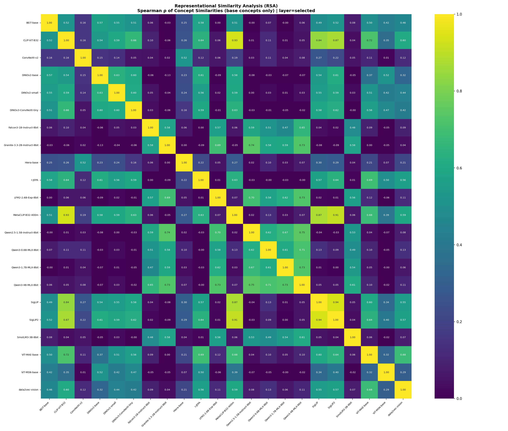
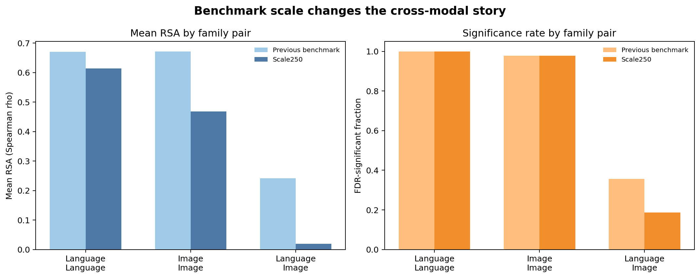

# Cross-Modal Representations

> **Cross-Modal Convergence Is Family-Local, Vision-Anchored, and Depth-Dependent: Evidence from a 250-Concept Benchmark**
>
> Abinash Karki (Independent Research) · March 2026 · Paper in preparation for TMLR

Do language models and vision models converge on the same internal representation of the world? The [Platonic Representation Hypothesis](https://arxiv.org/abs/2405.07987) says yes — that as models scale, modality should matter less.

This study tests that claim on **Scale250**, a 250-concept, source-balanced benchmark evaluated across a **25-model panel** spanning language models, self-supervised vision models, contrastive vision-language encoders, and autoregressive VLMs. The answer is more structured than yes or no.

### Key Findings

| Mode | What happens | Strength |
|------|-------------|----------|
| **Within-family** | Language–language and VLM–VLM models agree strongly | RSA 0.61 (lang), 0.89 (VLM) |
| **Bridge** | VLMs sit closer to vision than language, regardless of architecture | Vision–language gap ~0.47 |
| **Cross-modal** | Language–vision alignment is weak | RSA 0.02; only 15/80 pairs survive FDR |

Expanding the benchmark from 20 to 250 concepts on the **same model panel** collapses language–image RSA from 0.24 to 0.02 while preserving within-family structure — small benchmarks materially overstate cross-modal convergence.

Additional analyses show convergence is **depth-dependent** (peaks at mid-to-late layers, not the terminal layer) and **scale-independent** in this panel (language model size 0.6B–4B shows no monotonic relationship with cross-modal alignment).

<p align="center">
  
  
</p>
<p align="center">
  <em>Left: RSA heatmap across the 25-model panel — strong within-family blocks, weak cross-modal signal.<br>
  Right: Expanding from 20 to 250 concepts collapses cross-modal estimates while preserving within-family structure.</em>
</p>

---

## Paper

- **Manuscript**: [manuscript/paper.md](./manuscript/paper.md) (source) · [HTML](./manuscript/paper.html) · [LaTeX](./manuscript/paper.tex)
- **Figure pack**: [manuscript/figures/scale250](./manuscript/figures/scale250)

## Study Design

The core panel of 22 models (8 language, 10 vision SSL, 4 contrastive VLMs) plus a 3-model autoregressive VLM extension. Evidence combines:

- Selected-layer and aligned five-layer depth profile evaluation
- Image bootstrap confidence intervals and Mantel permutation tests with FDR correction
- Prompt-sensitivity analysis across language model templates
- CKA metric triangulation (Pearson 0.72, Spearman 0.71 agreement with RSA)
- Benchmark-sensitivity analysis (20 → 250 concepts, same panel)

## Reproducibility

This repo is intentionally lean. It keeps the canonical manuscript, figure pack, manifests, core
scripts, and small paper-facing summary artifacts in git. Heavy compiled outputs, raw embedding
dumps, caches, and image payloads are excluded from git and described in
[artifacts/release_manifest.json](./artifacts/release_manifest.json).

### Three modes of use

1. **Read the paper** and inspect the small release-facing artifacts already checked in.
2. **Reproduce analyses** from compiled artifacts after restoring the heavy bundles locally.
3. **Reconstruct the dataset** from the public roster, provenance tables, and build scripts.

These modes are intentionally separate. The checked-in
[data/data_manifest_250.json](./data/data_manifest_250.json) is the canonical analysis manifest and
references image payloads excluded from git. For a fresh public rebuild, start from
[data/concept_roster_250_scaffold.json](./data/concept_roster_250_scaffold.json) and
[docs/dataset_reconstruction.md](./docs/dataset_reconstruction.md).

### Getting started

```bash
# 1. Create environment
conda env create -f environment.yml
conda activate cross-modal-representations

# 2. Run release guardrail check
python src/release_checks.py

# 3. (Optional) Materialize heavy artifacts from local archive
python src/materialize_release_artifacts.py --from-local-archive --all

# 4. (Optional) Regenerate paper figures and renders
make paper-figures
make paper-render
```

Full guides: [release_reproducibility.md](./docs/release_reproducibility.md) · [dataset_reconstruction.md](./docs/dataset_reconstruction.md) · [modular_runbook.md](./docs/scale250_modular_runbook.md)

## Repository Layout

```
data/           Canonical analysis manifest, concept roster, provenance metadata
docs/           Model panels, runbook, release/repro documentation
manuscript/     Canonical paper, figure pack, archival material
results/        Canonical paper artifacts and archived comparison outputs
src/            Core pipeline — extraction, compilation, robustness, scaling, figures
artifacts/      Manifest and checksums for large excluded artifacts
fixtures/       Smoke-test data for dataset rebuild verification
```

### Core scripts

| Script | Purpose |
|--------|---------|
| `src/main_replication.py` | Main extraction and replication entry point |
| `src/compile_results.py` | Compile raw results into analysis-ready artifacts |
| `src/robustness_analysis.py` | Bootstrap and permutation robustness analysis |
| `src/scaling_analysis.py` | Model-scale relationship analysis |
| `src/analyze_arvlm_extension.py` | Autoregressive VLM architecture extension |
| `src/generate_scale250_paper_figures.py` | Generate all paper figures |
| `src/visualize_replication_results.py` | Interactive result visualization |
| `src/release_checks.py` | Pre-release guardrail verification |

## What Is Not In Git

Image payloads, full per-model raw embeddings, large compiled result artifacts, local run logs,
caches, smoke runs, model weights, and HF caches. These are indexed in
[artifacts/release_manifest.json](./artifacts/release_manifest.json) and can be restored from
`.local_artifacts/` in a local working copy.

## Archive

Earlier small-benchmark materials are retained for comparison context:

- Archived earlier paper: [manuscript/legacy/where_representations_diverge](./manuscript/legacy/where_representations_diverge)
- Archived comparison results: [results/baseline](./results/baseline), [results/aligned5](./results/aligned5), [results/v2_change_assets](./results/v2_change_assets)

## Citation

```bibtex
@software{karki2026crossmodal,
  author    = {Karki, Abinash},
  title     = {Cross-Modal Convergence Is Family-Local, Vision-Anchored,
               and Depth-Dependent: Evidence from a 250-Concept Benchmark},
  year      = {2026},
  url       = {https://github.com/abinashkarki/cross-modal-representations},
  license   = {MIT}
}
```

Full citation metadata: [CITATION.cff](./CITATION.cff)

## License

[MIT](./LICENSE)
