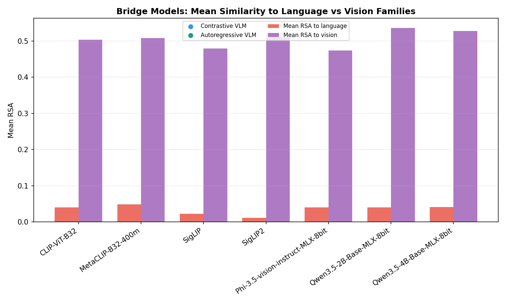
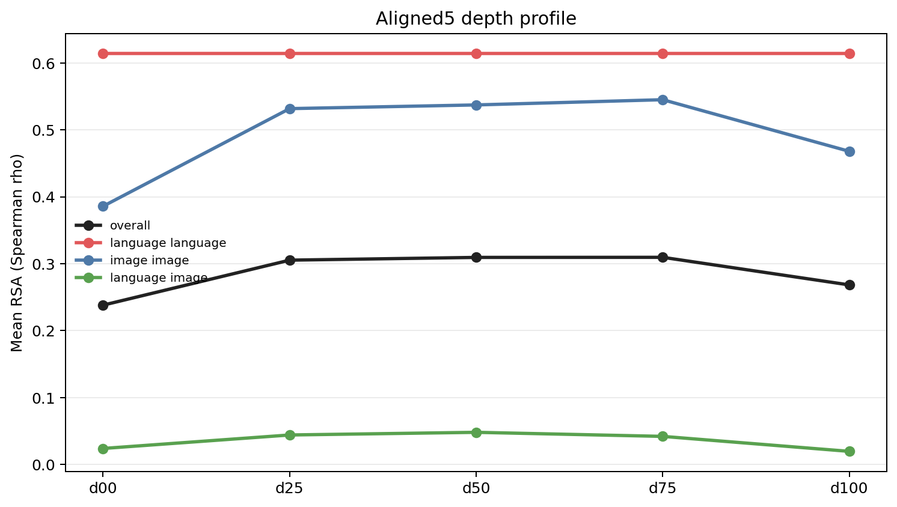
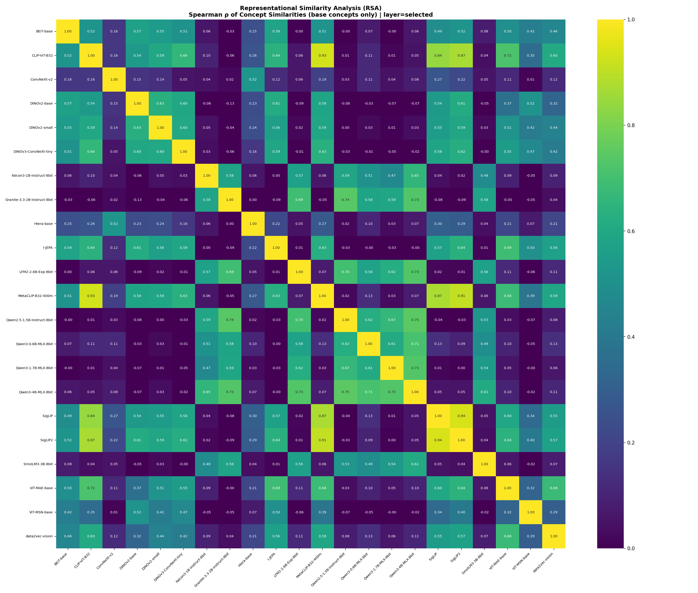
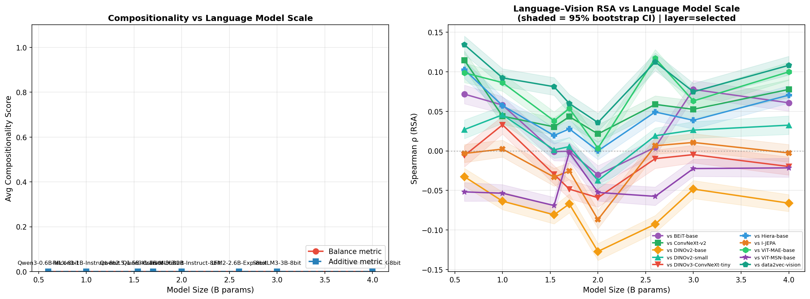
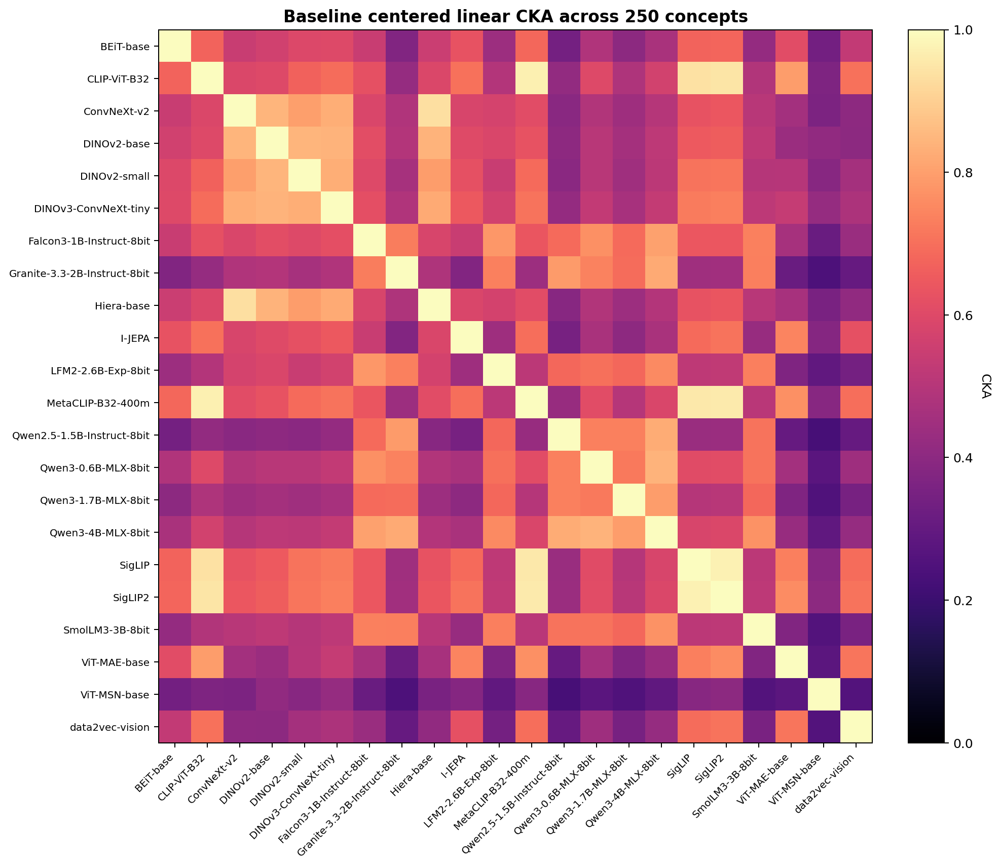
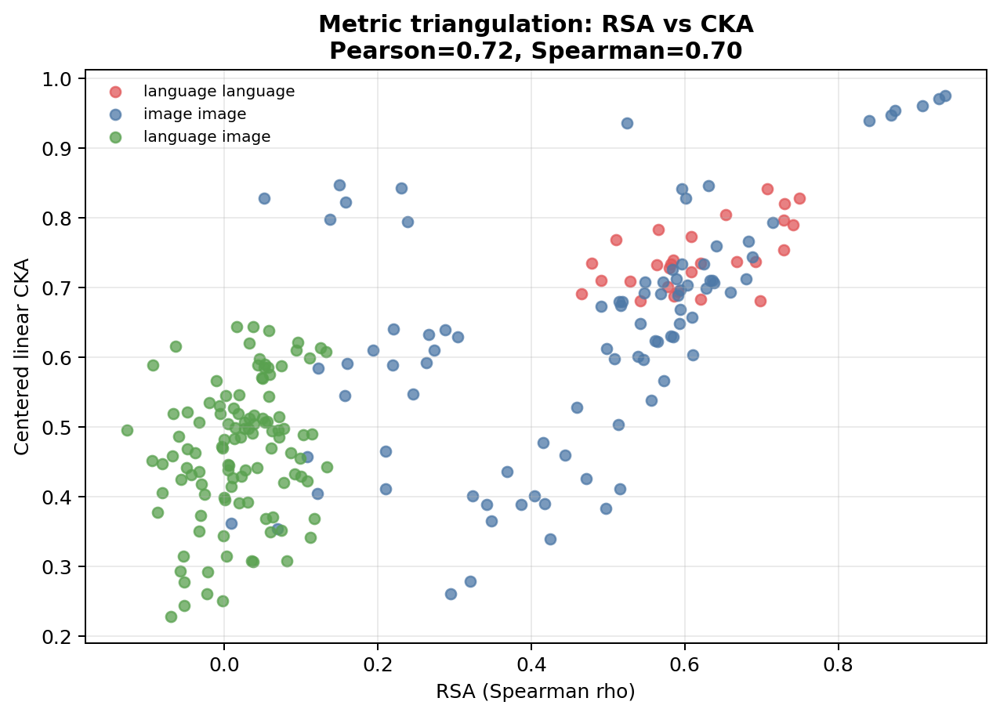
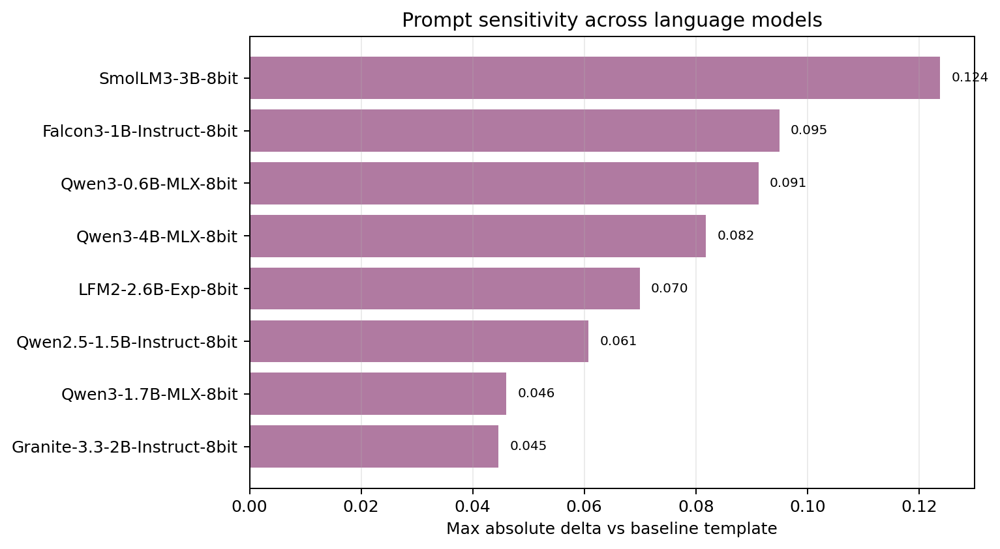

## Introduction

### The Question Behind the Hypothesis

The Platonic Representation Hypothesis (PRH) asks whether models trained on different modalities
converge toward a shared internal geometry because they are all modeling the same world (Huh et al.,
2024). In its strong form, the hypothesis predicts that modality should matter less and less as
capability grows: a language model and a vision model, trained on different data with different
objectives, should still come to organize concepts similarly.

That is a stronger claim than task transfer or interface compatibility. It is a claim about
inevitability in representation itself. The relevant question is therefore not whether some
cross-modal signal can be detected on a favorable benchmark, but whether that signal survives a
harder and more balanced measurement regime. This paper provides that test and finds that the answer
is more structured than a simple yes or no: what emerges is a taxonomy of three distinct convergence
modes rather than broad cross-modal alignment.

### Why Measurement Design Matters

The central risk in this literature is not only false positives. It is effect-size inflation from
narrow, source-skewed, or otherwise convenient benchmarks. A study can detect genuine cross-modal
signal while still overstating how broad or durable that signal is. Recent work on metric
calibration (Groger et al., 2026) has shown that standard representational similarity measures can
be confounded by network scale, and benchmark design studies in vision-language evaluation (Dixit
et al., 2023) have demonstrated that reported performance gains can be substantially inflated by
distributional artifacts.

The present study addresses this concern through benchmark design rather than metric calibration.
The model roster is held fixed so that the experimental work is done by measurement design rather
than by changing the panel. The concept benchmark expands to 250 base concepts, compounds are
removed from the main confirmatory claim, source balance is enforced within concept, and depth,
robustness, and metric-triangulation analyses are specified as part of the study rather than as an
afterthought.

### Scale250 Study Design

The study evaluates a 25-model panel on Scale250, a structured 250-concept benchmark with strict
within-concept source balance. The core panel consists of 22 models: 8 language models, 10
self-supervised vision models, and 4 contrastive vision-language encoders. An architecture extension
adds 3 autoregressive VLMs to test whether bridge-model behavior is architecture-dependent.

The evidence package combines a selected-layer evaluation, an aligned five-layer depth profile,
image bootstrap confidence intervals, Mantel permutation tests with FDR correction,
prompt-sensitivity analysis, CKA triangulation, and a benchmark-sensitivity analysis comparing
Scale250 with an earlier 20-concept benchmark on the same model panel.

The study is organized around five findings, each supported by its own evidence base: (1) benchmark
expansion collapses the cross-modal estimate; (2) convergence is family-local; (3) bridge models
are vision-anchored across architectures; (4) shared structure is depth-dependent; (5)
language-model scale does not rescue cross-modal alignment.

### Contributions

The study makes five contributions:

1. It demonstrates that benchmark expansion from 20 to 250 concepts collapses language-image RSA
   by an order of magnitude on the same model panel, establishing benchmark scope as a first-class
   variable in cross-modal convergence claims.
2. It characterizes family structure directly, revealing three distinct convergence modes:
   strong within-family, vision-anchored bridge, and weak cross-modal.
3. It shows that vision-anchored bridge behavior persists across both contrastive dual encoders and
   autoregressive VLMs, with nearly identical vision-minus-language gaps.
4. It identifies depth-dependent convergence: shared structure peaks at mid-to-late aligned layers
   rather than the terminal selected layer.
5. It shows that language-model size (0.6B--4B) does not predict cross-modal alignment in this
   panel.

### Research Questions

The paper is organized around six questions:

- **RQ1**: How does benchmark scale change the estimated strength of cross-modal convergence when
  the model panel is held fixed?
- **RQ2**: On the 250-concept benchmark, how much geometry is shared within and across modality
  families?
- **RQ3**: Do contrastive VLM image towers and autoregressive VLMs behave as modality-neutral
  bridges, or do they remain more closely tied to the vision family?
- **RQ4**: Does aligned-layer analysis reveal stronger shared structure than selected-layer
  evaluation?
- **RQ5**: Does language-model size predict stronger vision alignment in this panel?
- **RQ6**: Do the main conclusions survive an alternate representational similarity metric?

## Related Work

### Cross-modal convergence and the Platonic Representation Hypothesis

The closest conceptual antecedent is the Platonic Representation Hypothesis of Huh et al. (2024),
which argues that sufficiently capable language and vision models exhibit increasing geometric
agreement across modalities. That work is valuable because it turns a philosophical intuition into
an empirical one: convergence becomes a measurement problem rather than a slogan. The present paper
addresses a narrower question. Instead of asking whether convergence can be shown on large curated
setups, it asks how much of the effect survives when a small local benchmark is replaced by a much
broader confirmatory one.

Recent work by Groger et al. (2026) has shown that standard representational similarity metrics can
be confounded by network scale: increasing model depth or width systematically inflates similarity
scores, and apparent global convergence weakens substantially after calibration. They propose an
Aristotelian Representation Hypothesis in which convergence is limited to local neighborhood
structure rather than global geometry. The present paper arrives at a compatible conclusion through
a different route. Rather than calibrating the metric, we broaden the benchmark and find that
cross-modal convergence weakens by an order of magnitude while within-family structure is preserved.

### Representational similarity metrics

Our measurement frame sits inside the broader literature on representational similarity. RSA
(Kriegeskorte et al., 2008) compares the relational geometry of concept representations rather than
their raw coordinates, which makes it especially useful when embedding dimensions differ across
model families. Canonical-correlation approaches such as SVCCA (Raghu et al., 2017) and
PWCCA-style analyses (Morcos et al., 2018) ask whether two representations span similar subspaces
even when their coordinates are not directly aligned. CKA (Kornblith et al., 2019) adds a
kernel-based alternative that is invariant to isotropic scaling and robust to differences in
representation width.

This paper treats metric triangulation as part of the contribution rather than an optional appendix.
RSA remains the main inferential target because the research question is about shared concept
geometry, but linear CKA is used as a second lens over the same concept-by-feature matrices. RSA
compares rank-ordered similarity structure in representational dissimilarity matrices; CKA compares
centered alignment between feature spaces. Agreement between them strengthens trust in the direction
of the result, not in any single numeric magnitude.

### Bridge models and the modality gap

The bridge-model question sits in a specific multimodal literature. Contrastive image-language
models such as CLIP (Radford et al., 2021) and SigLIP (Zhai et al., 2023) are designed to make
language and image embeddings interoperable. The SigLIP2 family (Tschannen et al., 2025) extends
this with self-supervised and captioning-based objectives. But interoperable interfaces do not
automatically imply modality-neutral internals. Liang et al. (2022) demonstrated that contrastive
multimodal models embed different modalities in geometrically separated regions of the shared
space -- the modality gap -- which persists from initialization through training. A dual-encoder
can align tasks while still preserving strong vision-anchored structure in its image tower. This
distinction is central to the present paper because the four contrastive VLMs in the panel are all
evaluated through their image-side representations.

### Internal representations in vision-language models

Recent interpretability work has begun probing the internal structure of multimodal models
layer by layer. Neo et al. (2024) applied mechanistic interpretability methods to LLaVA and found
that visual question answering exhibits mechanisms similar to in-context learning, with visual
features showing significant interpretability when projected into the embedding space. Jiang et al.
(2024) demonstrated that layer-wise representational similarity in transformers follows a
characteristic progression, with simple cosine-based measures aligning well with CKA across depth.
These findings provide context for the present paper's depth analysis, which asks whether
cross-modal convergence is stronger at mid-to-late aligned layers than at the terminal selected
layer.

### Benchmark design and measurement inflation

This paper also contributes to a tradition of benchmark design and measurement clarification in
vision-language evaluation. Thrush et al. (2022) showed that state-of-the-art models performed
near chance on Winoground, a compositionality benchmark, despite strong reported performance on
simpler evaluations. Dixit et al. (2023) demonstrated that compositionality improvements reported
on several benchmarks were substantially overestimated due to distributional artifacts in the
negative examples. These studies establish a broader pattern: reported effect sizes in
vision-language evaluation depend materially on benchmark construction. The present paper
contributes a parallel finding for representational geometry: cross-modal convergence estimates
depend materially on concept-set breadth and source balance.

## Methods

### Confirmatory Design Overview

The full study is built around a simple contract: keep the model panel fixed, scale the concept
benchmark aggressively, and separate the primary confirmatory benchmark from supporting analyses.

**Table 1: Scale250 study design.**

| Component | Current experiment |
|-----------|--------------------|
| Core model panel | 22 models |
| Model families | 8 language, 10 vision SSL, 4 vision-language |
| Secondary architecture extension | +3 autoregressive VLMs (25 models complete overall) |
| Primary concept set | 250 base concepts |
| Concept design | stratified a priori, 10 strata x 25 concepts |
| Compound concepts in primary set | none |
| Images per concept | 15 |
| Per-concept source balance | 5 ImageNet, 5 Open Images, 5 Unsplash |
| Text templates extracted | `baseline3` (`t0`, `t1`, `t2`) |
| Main layer protocols | selected-layer baseline and `aligned5` |
| Bootstrap | 300 draws, 10 images per concept, with replacement |
| Significance test | 3,000-permutation Mantel, BH FDR |
| Secondary metric | linear CKA on concept-by-feature matrices |

### Model Panel and Architecture Extension

The core 22-model roster is fixed throughout the main study. This is deliberate. Holding the panel
constant lets benchmark design and analysis protocol do the experimental work.

**Table 2: Model roster.**

| Family | Models |
|-------|--------|
| Language (8) | Falcon3-1B-Instruct-8bit, Granite-3.3-2B-Instruct-8bit, LFM2-2.6B-Exp-8bit, Qwen2.5-1.5B-Instruct-8bit, Qwen3-0.6B-MLX-8bit, Qwen3-1.7B-MLX-8bit, Qwen3-4B-MLX-8bit, SmolLM3-3B-8bit |
| Vision SSL (10) | BEiT-base, ConvNeXt-v2, DINOv2-base, DINOv2-small, DINOv3-ConvNeXt-tiny, Hiera-base, I-JEPA, ViT-MAE-base, ViT-MSN-base, data2vec-vision |
| Vision-Language (4) | CLIP-ViT-B32, MetaCLIP-B32-400m, SigLIP, SigLIP2 |

The language panel deliberately spans multiple architecture families (Falcon, Granite, LFM, Qwen,
SmolLM) across a 0.6B--4B parameter range, all instruction-tuned. The vision panel spans multiple
self-supervised paradigms: masked autoencoders (ViT-MAE, BEiT), self-distillation (DINOv2, DINOv3),
joint-embedding predictive architectures (I-JEPA), contrastive feature prediction (data2vec),
convolutional adaptation (ConvNeXt-v2, Hiera), and masked siamese networks (ViT-MSN). This
diversity is deliberate: within-family convergence is more meaningful when the families are
internally heterogeneous.

All language models are evaluated at 8-bit quantization. Quantization at this level preserves
relative activation magnitudes and is unlikely to affect Spearman rank-order structure. The
consistent within-family agreement (all 28 language-language pairs significant after FDR correction)
serves as an internal check that quantization does not degrade the representational signal. A direct
comparison of Qwen3-0.6B at full precision versus 8-bit on the same 28-concept subset yields
per-concept cosine similarity of 0.9994 (min 0.9991) and RSA $\rho$ = 0.9990, confirming that 8-bit
quantization preserves representational geometry for this model family.

The vision-language models require a specific caveat: the core panel contains **contrastive
dual-encoder models** (CLIP, MetaCLIP, SigLIP, SigLIP2), and the analysis uses their **image
towers**. Any claim about bridge-model behavior in the core 22-model analysis is therefore scoped to
contrastive image-encoder-side representations.

To test whether bridge-model behavior is architecture-dependent, the study adds three autoregressive
VLMs on the same 250-concept benchmark: `Qwen3.5-2B-Base`, `Qwen3.5-4B-Base`, and
`Phi-3.5-vision-instruct`. These models are evaluated at the selected layer only, because the
MLX-VLM extraction path does not yet expose a stable cross-family internal layer stack for aligned
depth analysis. The architecture extension asks a specific question: when native autoregressive
multimodal models are added, do they sit closer to language, closer to vision, or in between?

### Benchmark Construction

The new benchmark is not a larger random sample. It is a structured benchmark. The manifest in
`data/data_manifest_250.json` specifies:

- a **stratified a priori** primary set (`base250`)
- **10 semantic strata** with **25 concepts each**
- **5 reserve concepts per stratum**
- **no compounds in the primary confirmatory set**
- **drop-concept-if-unbalanced** enforcement

The 10 target strata are:

- animals
- plants and fungi
- food and drink
- clothing and accessories
- tools and household objects
- furniture, appliances, and containers
- vehicles and machines
- buildings and infrastructure
- natural landforms and waterscapes
- musical instruments

Each concept has exactly 15 accepted images. The source policy is within-concept balanced:
5 ImageNet, 5 Open Images, and 5 Unsplash images per concept, with no substitution allowed. That is
a major improvement over the earlier project state because source diversity is now built into the
benchmark rather than treated mainly as a post hoc nuisance variable.

### Embedding Extraction

Language-side concept embeddings are extracted from short definitional prompts using the three
`baseline3` templates:

- `The concept of {concept}`
- `An example of {concept}`
- `The meaning of {concept}`

The selected-layer baseline uses the model's default terminal representation. The aligned-layer pass
uses five standardized depth fractions:

- `d00`
- `d25`
- `d50`
- `d75`
- `d100`

For image-side models, per-image embeddings are extracted first and aggregated to concept-level
representations. Image-level embeddings are cached, which allows image bootstrap and layer analysis
without rerunning the forward passes.

For the autoregressive VLM extension, image-conditioned representations are extracted through the
MLX-VLM `get_input_embeddings(...)` path after multimodal processor preparation. The representation
used for analysis is the final inserted image-token embedding aggregated over the image tokens for a
single image, then averaged to the concept level in the same way as the other image-side models. This
path provides one comparable selected-layer representation per image but does not yet expose a stable
cross-family internal layer stack. The autoregressive VLM extension is therefore selected-layer only.

### RSA and Statistical Inference

For each model:

1. construct a concept-by-concept cosine similarity matrix,
2. extract the upper triangle,
3. compare model pairs with Spearman RSA.

The primary inferential package has two parts:

- **image bootstrap**: 300 draws, 10 images per concept, sampling with replacement
- **Mantel significance**: 3,000 permutations per model pair, two-sided p-values, BH FDR over 231
  pairs

We also compute prompt sensitivity from the three extracted templates and run the same robustness
package on the aligned5 pass.

### CKA Triangulation

RSA is the main analysis because the paper is about shared concept geometry, but we add a second
metric to test whether the qualitative ordering survives outside the RSA family. For the selected
layer baseline, we build one concept-by-feature matrix per model using the same 250 concept
representations used in the RSA analysis. Each matrix is row-normalized across concepts before
comparison, and we compute pairwise **linear CKA** between all model pairs.

This CKA analysis is intentionally used as triangulation rather than as a second significance layer.
The inferential package remains tied to RSA, bootstrap, and Mantel tests. The CKA question is
qualitative: does the same family structure appear when we compare centered feature spaces rather
than ranked similarity matrices?

### Benchmark-Sensitivity Analysis

Section 4.1 presents a benchmark-sensitivity analysis comparing Scale250 with an earlier
unpublished 20-concept benchmark evaluated on the same 22-model panel. The earlier benchmark used
20 base concepts for RSA plus 8 compound probes for exploratory analysis. This comparison is used as
an internal validity demonstration: by holding the model panel constant and varying only the concept
set, it isolates the effect of benchmark scope on the cross-modal convergence estimate.

## Results

### Benchmark Scale Changes the Cross-Modal Estimate

The first result is methodological. When the same 22-model core panel is evaluated on a broader,
source-balanced benchmark, the cross-modal convergence estimate changes by an order of magnitude.

The earlier benchmark is unpublished prior work by the same author, using the same 22-model roster
but only 20 base concepts for RSA plus 8 compound probes for exploratory analysis. Scale250 replaces
that with 250 stratified base concepts, strict within-concept source balance, and no compounds in
the primary set. The model panel is identical. Only the benchmark changes.

**Table 3: Broad family comparison, earlier 20-concept benchmark vs. Scale250.**

| Benchmark | Language-Language mean $\rho$ | Image-Image mean $\rho$ | Language-Image mean $\rho$ | Significant pairs |
|-----------|------------------------------:|------------------------:|---------------------------:|------------------:|
| Earlier 20-concept benchmark | 0.6703 | 0.6721 | 0.2418 | 157 / 231 |
| Scale250 baseline | 0.6143 | 0.4681 | 0.0199 | 138 / 231 |

The benchmark expansion does not shrink everything uniformly. Language-language agreement stays
strong (0.6703 to 0.6143). Image-image agreement drops moderately (0.6721 to 0.4681). But
language-image agreement collapses from 0.2418 to 0.0199 -- a 12-fold reduction -- and the
FDR-significant fraction falls from 40/112 to 21/112. This asymmetry matters: the broader
benchmark selectively weakens the cross-modal signal while preserving within-family structure.

The image-bootstrap confidence intervals also tighten substantially:

- earlier benchmark mean CI width: 0.1787
- Scale250 mean CI width: 0.0552

Scale250 is therefore not only a harder benchmark. It is a more statistically stable one. The
broader concept set shrinks uncertainty enough that the weak cross-modal signal can be interpreted
with confidence rather than dismissed as noise.

### Convergence Is Family-Local

With benchmark sensitivity established, the Scale250 baseline reveals three distinct convergence
modes in the 22-model core panel.

**Table 4: Fine-grained pairwise RSA summary for the Scale250 baseline.**

| Pair type | Pairs | Mean $\rho$ | Median $\rho$ | Significant after FDR |
|----------|------:|------------:|--------------:|----------------------:|
| Language-Language | 28 | 0.6143 | 0.5994 | 28 / 28 |
| Vision-Vision | 45 | 0.3827 | 0.4248 | 43 / 45 |
| VLM-VLM | 6 | 0.8938 | 0.8921 | 6 / 6 |
| Vision-VLM | 40 | 0.5003 | 0.5584 | 40 / 40 |
| Language-Vision | 80 | 0.0155 | 0.0149 | 15 / 80 |
| Language-VLM | 32 | 0.0308 | 0.0372 | 6 / 32 |

These numbers define three convergence regimes:

**Within-family convergence is strong.** Language models agree strongly with one another (mean
0.6143, all 28 pairs significant). Vision models show substantial internal agreement (mean 0.3827,
43/45 significant). Contrastive VLMs agree extremely strongly with one another (mean 0.8938). This
is genuine convergence, but it is convergence within modality families, not across them.

**Bridge convergence is real but vision-anchored.** The contrastive VLM image towers agree strongly
with pure vision models (mean 0.5003, all 40 pairs significant) but only weakly with language
models (mean 0.0308, 6/32 significant). These bridge models are better interpreted as
vision-anchored interfaces than as evidence of modality-neutral convergence.

**Cross-modal convergence is weak.** Language-vision RSA averages 0.0155, with only 15 of 80 pairs
surviving FDR correction. The strongest positive pairs in the panel are all on the image side:

- `SigLIP` vs `SigLIP2`: 0.9397
- `CLIP-ViT-B32` vs `MetaCLIP-B32-400m`: 0.9306
- `MetaCLIP-B32-400m` vs `SigLIP2`: 0.9100

The most negative pairs are all cross-modal and modest in magnitude:

- `DINOv2-base` vs `Granite-3.3-2B-Instruct-8bit`: -0.1271
- `Granite-3.3-2B-Instruct-8bit` vs `SigLIP2`: -0.0941
- `DINOv2-base` vs `LFM2-2.6B-Exp-8bit`: -0.0927

### Bridge Models Are Vision-Anchored Across Architectures

Both contrastive and autoregressive VLMs are vision-anchored, with nearly identical
vision-minus-language gaps. This result extends the bridge-model finding from the core 22-model
panel to a 25-model panel that includes three native autoregressive multimodal models.

**Table 5: Bridge-model family summary in the 25-model architecture extension.**

| Bridge family | Mean to language | Mean to vision | Mean within family | Mean to contrastive VLM | Vision minus language |
|--------------|-----------------:|---------------:|-------------------:|------------------------:|----------------------:|
| Contrastive VLM (4) | 0.0308 | 0.5003 | 0.8938 | - | 0.4695 |
| Autoregressive VLM (3) | 0.0404 | 0.5122 | 0.9011 | 0.7202 | 0.4718 |

The vision-minus-language gap is 0.4695 for contrastive VLMs and 0.4718 for autoregressive VLMs.
That near-identity is striking. It means vision-anchored bridge behavior is not an artifact of the
contrastive training objective. The per-model pattern is consistent:

- `Qwen3.5-2B-Base-MLX-8bit`: 0.5357 to vision, 0.0399 to language
- `Qwen3.5-4B-Base-MLX-8bit`: 0.5272 to vision, 0.0410 to language
- `Phi-3.5-vision-instruct-MLX-8bit`: 0.4737 to vision, 0.0403 to language

The architecture extension is narrow (3 AR-VLMs, 2 from the Qwen family) and selected-layer only.
It does not answer every multimodal question. But it materially widens the scope of the
bridge-model claim: on this benchmark and under a selected-layer extraction regime, both contrastive
VLMs and autoregressive VLMs look far more vision-like than language-like.

### Shared Structure Is Depth-Dependent

If cross-modal convergence is weak at the final layer, is it weak everywhere? The aligned-layer
analysis shows it is not. Shared structure peaks at mid-to-late network depth rather than the
terminal selected layer.

**Table 6: Mean RSA by aligned depth fraction in the 250-concept run.**

| Depth | Overall | Language-Language | Image-Image | Language-Image |
|------|--------:|------------------:|------------:|---------------:|
| d00 | 0.2381 | 0.6143 | 0.3859 | 0.0240 |
| d25 | 0.3053 | 0.6143 | 0.5317 | 0.0441 |
| d50 | 0.3094 | 0.6143 | 0.5372 | 0.0481 |
| d75 | 0.3096 | 0.6143 | 0.5450 | 0.0420 |
| d100 | 0.2683 | 0.6143 | 0.4679 | 0.0197 |

This depth pattern is the study's main positive finding. Language-language agreement is flat across
all depth fractions -- language models organize concepts similarly regardless of which layer is
read. But image-image agreement rises from 0.3859 at d00 to 0.5450 at d75, and language-image
agreement peaks at 0.0481 (d50) before falling back to 0.0197 at the terminal layer. Whatever
shared geometry exists in this panel is strongest in mid-to-late aligned layers, not at the final
readout.

At the same time, aligned layers do **not** rescue a strong PRH reading. The selected-layer baseline
and terminal aligned-layer summaries are nearly identical: both have 138/231 significant model-pair
results, the mean absolute pairwise shift is only 0.0002, and 210 of 231 pairwise RSA values are
unchanged exactly. Depth changes *where* the convergence signal is most visible, not *whether* the
high-level conclusion changes. Convergence is depth-dependent, but even at its peak it remains
family-local rather than broadly cross-modal.

### Scale Does Not Rescue Cross-Modal Convergence

A natural defense of PRH would be that cross-modal alignment increases with model size. In this
panel, it does not. The Spearman correlation between language-model size and mean vision RSA is
-0.0952 -- effectively no monotonic relationship.

The per-model pattern is mixed:

- best mean vision alignment: `Qwen3-0.6B-MLX-8bit` at 0.0455
- worst mean vision alignment: `Granite-3.3-2B-Instruct-8bit` at -0.0333
- `Qwen3-4B-MLX-8bit` improves over the 2B and 1.5B cases, but not over the 0.6B case

This does not rule out scaling effects at frontier model sizes. It means that within the 0.6B--4B
regime, size is not the dominant variable for cross-modal geometric alignment. Architecture family,
training data, and objective appear to matter more than raw parameter count.

### Robustness and Validation

#### Metric triangulation with CKA

The three-mode taxonomy is not an artifact of the RSA metric. Linear CKA over the same
concept-by-feature matrices preserves the same family ordering.

**Table 7: Broad family comparison under linear CKA.**

| Pair type | Pairs | Mean CKA | Median CKA |
|----------|------:|---------:|-----------:|
| Language-Language | 28 | 0.7429 | 0.7350 |
| Image-Image | 91 | 0.6338 | 0.6407 |
| Language-Image | 112 | 0.4657 | 0.4766 |

For this summary, the four contrastive VLM image encoders are grouped with the image side. Under
that definition, the same broad ordering survives: language-language is highest, image-image is
next, and language-image is weakest. Pairwise agreement between RSA and CKA over all 231 model
pairs is substantial (Pearson 0.7229, Spearman 0.7050).

The same top families dominate under CKA: `SigLIP` vs `SigLIP2` (0.9749), `CLIP-ViT-B32` vs
`MetaCLIP-B32-400m` (0.9712), `MetaCLIP-B32-400m` vs `SigLIP2` (0.9605). The numeric gap between
families is less stark under CKA than under RSA, which is expected: CKA is a centered alignment on
feature matrices bounded positive in this implementation, while RSA is a rank correlation that can
go negative. The important result is not that the numbers match exactly, but that the qualitative
family ordering survives a second metric family.

#### Prompt sensitivity and bootstrap stability

Prompt sensitivity is present but does not threaten the main conclusions. Across the 8 language
models:

- mean maximum absolute shift vs. baseline template: 0.0766
- median maximum absolute shift: 0.0818
- maximum shift: 0.1238 (`SmolLM3-3B-8bit`)
- minimum shift: 0.0446 (`Granite-3.3-2B-Instruct-8bit`)

Even the largest prompt-induced shift (0.1238) is far too small to close the gap between
within-family convergence (L-L mean 0.6143) and cross-modal agreement (L-I mean 0.0199). Prompt
choice moves the cross-modal estimate modestly but does not change the structural story.

## Discussion

### Three Modes of Convergence

The Scale250 study reveals three distinct convergence regimes rather than broad cross-modal
alignment. Within-family convergence is strong and robust: language models agree with language
models (mean RSA 0.6143), vision models agree with vision models (mean 0.3827), and contrastive
VLMs agree extremely strongly with one another (mean 0.8938). Bridge convergence is real but
vision-anchored: both contrastive and autoregressive VLMs sit far closer to the vision family than
to the language family, with nearly identical vision-minus-language gaps. Cross-modal convergence is
weak: language-image RSA averages 0.0199, with only 15 of 80 pairs surviving FDR correction.

This taxonomy is the paper's primary conceptual contribution. It replaces the binary question --
does convergence exist? -- with a structured answer: convergence is strong within families,
vision-anchored at the interface, and weak across the language-image boundary. Each mode is
supported by its own evidence base and survives metric triangulation with CKA.

### Vision-Anchored Bridge Models Across Architectures

The bridge-model result is conceptually important because it distinguishes interface compatibility
from representational convergence. In the core 22-model panel, the bridge models are contrastive
dual encoders evaluated through their image towers. In the architecture extension, they include
three native autoregressive VLMs evaluated through image-conditioned selected-layer embeddings.
Under both regimes, they cluster strongly with vision.

This does **not** prove that all multimodal models are vision-anchored under every extraction
choice. It supports a narrower and useful claim: effective multimodal interfaces can be built
without erasing modality-shaped internal structure. The consistency of the vision-minus-language gap
across contrastive (0.4695) and autoregressive (0.4718) architectures suggests that
vision-anchored bridge geometry may be a general property of current multimodal models rather than
an artifact of any single training objective.

The modality gap literature provides a complementary perspective. Liang et al. (2022) showed that
contrastive models embed modalities in geometrically separated regions from initialization onward.
The present finding extends this: even autoregressive VLMs that do not use a contrastive objective
show a similar geometric separation between their image-conditioned representations and pure
language-model representations.

### Depth-Dependent Convergence

The aligned-layer result is the study's most constructive positive finding. Shared geometry peaks
at mid-to-late aligned layers (d75) rather than the terminal selected layer. This suggests that
convergence, such as it is, is better understood as a developmental pattern across network depth
than as a property of final-layer readouts alone.

This finding is consistent with the layer-wise progression observed by Jiang et al. (2024), where
representational similarity follows characteristic patterns across depth. In the present study,
language-language agreement is flat across all depth fractions, while image-image and
language-image comparisons rise through mid-layers before falling back at the terminal layer. One
interpretation is that mid-to-late layers capture broader structural relationships before
task-specific final readout behavior narrows the representation.

This keeps a weaker Platonic story alive. Cross-modal convergence does not appear and disappear
randomly; it follows a depth trajectory. But even at its peak, the signal remains modest and
family-local. Depth-dependent convergence is a real phenomenon in this panel, not yet evidence of
a universal shared geometry.

### Benchmark Design as a First-Class Variable

The benchmark-sensitivity analysis shows that cross-modal convergence estimates depend materially
on benchmark scope. On the same 22-model panel, language-image RSA dropped from 0.2418 on a
20-concept benchmark to 0.0199 on Scale250. Within-family structure survived the expansion.

This finding is consistent with a broader pattern in vision-language evaluation. Dixit et al. (2023)
showed that compositionality improvements were substantially overestimated due to distributional
artifacts, and Groger et al. (2026) demonstrated that representational similarity metrics can be
inflated by network scale. The present paper contributes a parallel finding for cross-modal
geometry: narrow benchmarks with limited concept diversity can inflate the apparent strength of
cross-modal convergence.

Benchmark scope is therefore not a minor implementation detail. It is a first-class variable in any
claim about representational convergence. The Scale250 estimates should be treated as the canonical
reference point for this panel.

### Metric Inflation and the Within-Family Baseline

The paper borrows motivation from Groger et al. (2026), who show that standard similarity metrics
can be inflated by network scale. A fair reading of that work raises the question of whether the
within-family baselines reported here---language-language RSA of 0.6143, VLM-VLM of 0.8938---carry
some of the same inflation. We do not claim they are free of it. Absolute magnitudes of RSA should
be interpreted cautiously across all family types, not only cross-modal ones. However, the paper's
central argument rests on the *relative ordering* across family types---within-family >> bridge >>
cross-modal---rather than on any single absolute value. That ordering is preserved even if all
magnitudes are shifted downward by a common scale confound, because the confound would apply
symmetrically to within-family and cross-modal pairs evaluated on the same benchmark. Additionally,
the CKA triangulation provides a partial check: linear CKA is invariant to isotropic scaling of the
feature matrices and has different sensitivity properties than Spearman RSA, yet it preserves the
same family ordering (Pearson 0.7229, Spearman 0.7050 agreement). A full calibration analysis in
the style of Groger et al. is beyond the scope of this study, but the convergence of two metrically
distinct measures on the same qualitative structure provides evidence that the three-mode taxonomy is
not an artifact of uncalibrated RSA alone.

### Scope and Limitations

This study does **not** refute the broadest possible version of PRH. Stronger cross-modal effects
could emerge under conditions not tested here. The main limitations are:

1. **Language-model scale tops out at 4B.** A stronger cross-modal effect could emerge at frontier
   scale. The present study shows only that scale does not rescue convergence in the 0.6B--4B
   regime.
2. **The concept set is concrete-heavy.** All 250 concepts are drawn from 10 concrete-object strata.
   Concrete, imageable nouns are generally considered the most favorable case for cross-modal overlap
   because they have unambiguous visual referents. The weak cross-modal signal reported here (L-I RSA
   0.0199) therefore reflects performance on an easy case; abstract concepts (e.g., justice,
   democracy, fear) could yield weaker or qualitatively different cross-modal patterns.
3. **The AR-VLM extension is narrow.** Three autoregressive VLMs (two from the Qwen family) provide
   directional evidence but not a comprehensive architecture survey.
4. **8-bit quantization.** All language models are evaluated at 8-bit quantization. A full-precision
   vs. 8-bit comparison for Qwen3-0.6B shows negligible geometric distortion (RSA $\rho$ = 0.9990),
   and 4-bit vs. 8-bit probes for Qwen3-1.7B and Qwen3-4B confirm stability (RSA $\rho$ = 0.8122
   and 0.9792 respectively). These checks cover one model family; non-quantized comparisons for the
   remaining language models would further strengthen confidence.
5. **No compositionality claim.** Compounds are excluded from the primary set, so the study does not
   address compositional convergence.
6. **Source-holdout is incomplete.** The current robustness implementation collapses source holdout
   to a single `mixed_balanced` regime, so a strong source-ablation result is not claimed.

### Implications and Future Directions

The three-modes taxonomy predicts where to look next. Each mode suggests a different experimental
frontier:

- **Within-family convergence** is already strong. The question is whether it extends to frontier
  models or breaks down with architectural divergence. Same-family scaling studies that separate
  architecture from parameter count would clarify.
- **Bridge convergence** is consistently vision-anchored. The next test is whether aligned-layer
  hooks for autoregressive VLMs reveal stronger language affinity at intermediate depths, or whether
  vision-anchored geometry persists across the full layer stack.
- **Cross-modal convergence** is weak on concrete concepts. A dedicated abstract-concept tranche
  would test whether abstraction increases or decreases cross-modal agreement. Broader VLM panels
  including non-Qwen autoregressive families would test architecture dependence.

The study narrows the open question. It no longer asks whether different modalities ever agree. They
do, weakly. The question is now: under what benchmark, architecture, and depth conditions does that
agreement become strong enough to count as evidence for a shared geometry?

## Conclusion

The Scale250 study replaces the binary question -- does cross-modal convergence exist? -- with a
taxonomy of three convergence modes, each empirically grounded on a 250-concept, source-balanced
benchmark evaluated on a 25-model panel.

1. **Within-family convergence is strong and robust.** Language models converge with language models,
   vision models with vision models. This structure survives benchmark expansion, metric
   triangulation, and prompt variation.
2. **Bridge convergence is vision-anchored, not modality-neutral.** Both contrastive and
   autoregressive VLMs sit far closer to the vision family than to language, with nearly identical
   vision-minus-language gaps across architectures.
3. **Cross-modal convergence is weak on a broad balanced benchmark.** Language-image RSA averages
   0.0199. Expanding the concept set from 20 to 250 on the same model panel collapses this estimate
   by an order of magnitude.
4. **Shared structure is depth-dependent.** Cross-family agreement peaks at mid-to-late aligned
   layers rather than the terminal selected layer.
5. **Language-model scale does not rescue cross-modal alignment** in the 0.6B--4B regime.

These findings do not refute the Platonic Representation Hypothesis in general. Stronger
cross-modal effects could emerge at frontier scale, with abstract concepts, or with richer
architecture surveys. What the study establishes is that cross-modal geometry, when measured
carefully, is more structured and more conditional than broad convergence claims suggest. The
taxonomy predicts where to look next: at the depth conditions where convergence strengthens, at the
abstract concepts where it might differ, and at the frontier models where scale could still change
the story.

## Code and Data Availability

Code, manifests, small paper-facing result artifacts, figure-generation code, and manuscript
sources are available in this repository and are intended to be published alongside the paper at
`https://github.com/abinashkarki/cross-modal-representations`. Heavy compiled Scale250 artifacts are
excluded from git and indexed in `artifacts/release_manifest.json` with checksums in
`artifacts/SHA256SUMS.txt`. The canonical in-repo artifacts for this paper are:

- `data/data_manifest_250.json`
- `results/scale250_full/baseline/robustness_opt_full/robustness_stats.json`
- `results/scale250_full/aligned5/robustness/robustness_stats.json`
- `results/scale250_full/baseline25_extension/architecture_analysis/architecture_summary.json`
- `src/generate_scale250_paper_figures.py`
- `src/analyze_arvlm_extension.py`
- `artifacts/release_manifest.json`
- `manuscript/figures/scale250/`

## References

Andreas, J. (2019). Measuring Compositionality in Representation Learning. *ICLR 2019*.

Dixit, A., Parmar, V., and Parekh, J. (2023). When Hard Negatives are Easy: Entity-Guided
Contrastive Evaluation of Visio-Linguistic Compositionality (SUGARCREPE). *NeurIPS 2023 Datasets
and Benchmarks Track*.

Groger, T., Wen, Y., and Brbic, M. (2026). Are Representations Converging? A Calibrated Study of
Similarity Metrics. *arXiv preprint arXiv:2602.14486*.

Huh, M., Cheung, B., Wang, T., and Isola, P. (2024). The Platonic Representation Hypothesis.
*ICML 2024*.

Jiang, T., Zhou, Z., and colleagues (2024). Tracing Representation Progression: Analyzing and
Enhancing Layer-Wise Similarity. *arXiv preprint arXiv:2406.14479*.

Kornblith, S., Norouzi, M., Lee, H., and Hinton, G. (2019). Similarity of Neural Network
Representations Revisited. *ICML 2019*.

Kriegeskorte, N., Mur, M., and Bandettini, P. A. (2008). Representational similarity analysis:
connecting the branches of systems neuroscience. *Frontiers in Systems Neuroscience*, 2, 4.

Liang, W., Zhang, Y., Kwon, Y., Yeung, S., and Zou, J. (2022). Mind the Gap: Understanding
the Modality Gap in Multi-modal Contrastive Representation Learning. *NeurIPS 2022*.

Mikolov, T., Sutskever, I., Chen, K., Corrado, G. S., and Dean, J. (2013). Distributed
representations of words and phrases and their compositionality. *NeurIPS 2013*.

Morcos, A. S., Raghu, M., and Bengio, S. (2018). Insights on representational similarity in neural
networks with canonical correlation. *NeurIPS 2018*.

Neo, B., and colleagues (2024). Understanding Multimodal LLMs: the Mechanistic Interpretability of
Llava in Visual Question Answering. *arXiv preprint arXiv:2411.10950*.

Radford, A., Kim, J. W., Hallacy, C., Ramesh, A., Goh, G., Agarwal, S., Sastry, G., Askell, A.,
Mishkin, P., Clark, J., Krueger, G., and Sutskever, I. (2021). Learning Transferable Visual Models
From Natural Language Supervision. *ICML 2021*.

Raghu, M., Gilmer, J., Yosinski, J., and Sohl-Dickstein, J. (2017). SVCCA: Singular Vector
Canonical Correlation Analysis for Deep Learning Dynamics and Interpretability. *arXiv preprint
arXiv:1706.05806*.

Thrush, T., Jiang, R., Bartolo, M., Singh, A., Williams, A., Kiela, D., and Ross, C. (2022).
Winoground: Probing Vision and Language Models for Visio-Linguistic Compositionality. *CVPR 2022*.

Tschannen, M., and colleagues (2025). SigLIP 2: Multilingual Vision-Language Encoders with Improved
Semantic Understanding, Localization, and Dense Features. *arXiv preprint arXiv:2502.14786*.

Zhai, X., Mustafa, B., Kolesnikov, A., and Beyer, L. (2023). Sigmoid Loss for Language Image
Pre-Training. *ICCV 2023*.

## Appendix A: Reproducibility Summary

- Supporting historical comparison benchmark: 20 base concepts for RSA, 8 compound probes, same
  22-model panel
- Primary Scale250 benchmark: 250 base concepts, no compounds in the primary set
- Secondary architecture extension: 3 completed autoregressive VLMs merged into a 25-model selected-layer panel
- Images per concept: 15
- Source policy: 5 ImageNet, 5 Open Images, 5 Unsplash per concept
- Model pairs tested: 231
- Bootstrap draws: 300
- Bootstrap image sample size: 10
- Mantel permutations per pair: 3,000
- Prompt templates extracted: 3
- Layer protocols: selected-layer baseline and aligned5
- Secondary metric: linear CKA on selected-layer concept matrices

## Appendix B: Files Used For This Paper

- `data/data_manifest_250.json`
- `results/scale250_full/baseline/robustness_opt_full/robustness_stats.json`
- `results/scale250_full/aligned5/robustness/robustness_stats.json`
- `results/scale250_full/baseline25_extension/architecture_analysis/architecture_summary.json`
- `artifacts/release_manifest.json`
- `artifacts/SHA256SUMS.txt`
- `src/analyze_arvlm_extension.py`
- `results/baseline/robustness/robustness_stats.json`
- `src/generate_scale250_paper_figures.py`
- `manuscript/figures/scale250/`
